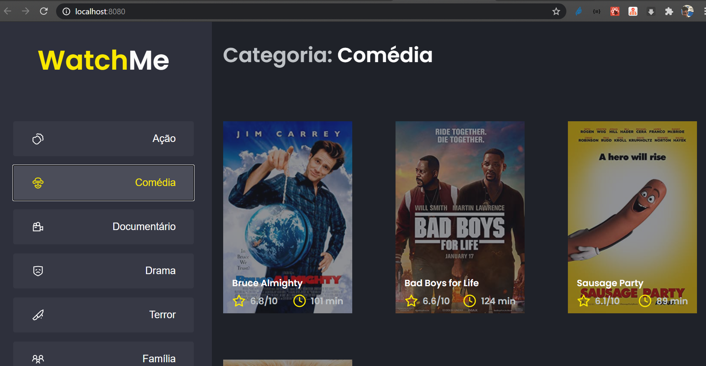

<h1 align="center">
    
</h1>

<h4 align="center"> 
	Ignite template componentizando - Desafio 2.0 🚀 
</h4>


## 💻 Sobre o Desafio 02

Essa será uma aplicação onde o seu principal objetivo é refatorar uma página para listagem de filmes de acordo com gênero. 

A aplicação já está totalmente funcional mas grande parte do seu código está diretamente no arquivo `App.tsx`. Para resolver isso da melhor forma, é necessário dividir a aplicação em **pelo menos** duas partes principais: sidebar e o conteúdo principal que possui o header e a listagem de filmes.

- A aplicação possui apenas uma funcionalidade principal que é a listagem de filmes;
- Na sidebar é possível selecionar qual categoria de filmes deve ser listada;
- A primeira categoria da lista (que é "Ação") já deve começar como marcada;
- O header da aplicação possui apenas o nome da categoria selecionada que deve mudar dinamicamente.
 🚀

Projeto desenvolvido durante a ignite oferecida pela [Rocketseat](rs).


## 🛠 Tecnologias

As seguintes ferramentas foram usadas na construção do projeto:

- [React][reactjs]
- [TypeScript][typescript]


## 🚀 Como executar o projeto

### Pré-requisitos

Antes de começar, você vai precisar ter instalado em sua máquina as seguintes ferramentas:
[Git](https://git-scm.com), [Node.js][nodejs]. 
Além disto é bom ter um editor para trabalhar com o código como [VSCode][vscode]

### 🎲 Rodando o Projeto

```bash
# Clone este repositório
$ git clone https://github.com/marlonery/reactjs-conceitos-do-react-desafio02

# Acesse a pasta do projeto no terminal/cmd
$ cd reactjs-conceitos-do-react-desafio02

# Instale as dependências
$ yarn install

# Execute a aplicação em modo de desenvolvimento
$ yarn server

# Execute a aplicação em modo de desenvolvimento
$ yarn dev

# O servidor inciará na porta:8080 - acesse http://localhost:8080/ 
```

## 📝 Licença

Este projeto esta sobe a licença MIT.

Feito com ❤️ por Marlon Nery 👋🏽 [Entre em contato!](https://www.linkedin.com/in/marlon-nery-37411479/)

[typescript]: https://www.typescriptlang.org/
[reactjs]: https://reactjs.org
[yarn]: https://yarnpkg.com/
